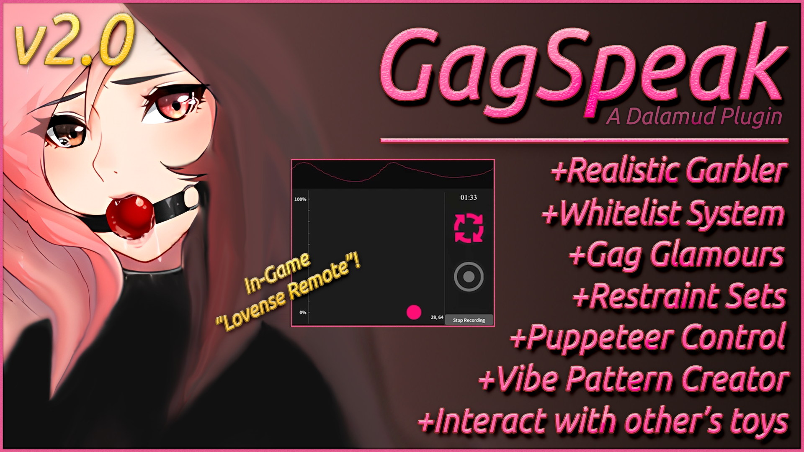

# Dalamud-GagSpeak 

# Overview
GagSpeak is made with the intent of being more than just a one-sided translator. Gagspeak will allow the user to muffle their speech using a sophisticated garbler algorithm, based on real life gag sound data, to accurately garble speech for each individual gag in their own unique way.
```
- tons of safety precautions and privacy checks
- has encrypted messaging
- whitelist management
- options to give yourself control over other users
- options to restrict others from having access to control you.
- setting a safeword
- setting your mode (Owner/Master/Mistress/Dominant/Submissive/Pet/Slave/AbsoluteSlave)
- define relations with players & view commitment times with one another
- Display a mini profile viewer pop-up windows
- integrated commands for macro automation
- View all nessisary information in the gagspeak debugger
- over 50 types of gags
- equip up to 3 gags at once
- chat garbler combines garble priorities of multiple gags together for further realism!
- link glamour items to each type of gag!
- Toggle if each gag item link is enabled or disabled individually
- toggle universally as well if you want too!
- Add endless ammounts of stored restraint sets!
- Self-Lock yourself into restraint sets, or lock others for set times!
- Revert to automation or game when disabled
- Restraint Sets can act as "overlays" or "Glamour Applications"
- Restraint Set Lists can be copied and sent to others so they have an autofill dropdown for you!
- Use the new puppeteer module
- Unique trigger phrases for each whitelisted player
- Global trigger phrases if you really want
- Alias tables for each whitelisted player to enhance how orders fit into conversation
- Setup custom start and end characters to what defines what is encosed within brackets.
- Configure what channels puppeteer trigger should be read from, seperate from gagspeak channels
- Experience the all new Toybox Module!
- Connect your bluetooth 'toy' to the toybox module
- Adjust its intensity easily with a slider in realtime
- Interact with other peoples toys via whitelist interactions
- Export or Import patterns compressed into sendable strings!
- Create your own patterns to share with others in the toybox workshop!
- Use the workshop's loop and float buttons to create unique styles of pattern vibrations
- Share your patterns in communities, or across DM's!
- Send your pattern list to whitelisted players you trust so they can execute them for you!
- View your toys battery & scan %
- Feel comfortable with defining your trust level with others using the new dynamic tier system!
- Bind mods and animations to toggle on and off with restraint sets
- Auto adjust priority up when toggled to not have any need to mess with other mods!
- Interact with the new unhinged hardcore tab!
- Gain full control over your submissive with the hardcore tab
- Enforce your submissive to follow you when ordered, unable to prevent it until they are finished
- Enforce your submissive to sit or groundsit when ordered, stuck until they allow you to stand again
- Veil your submissives eyes with lace with the new blindfold feature, limiting their sight
- Lock your submissive away in chambers or estate rooms, preventing them from leaving~
- New UI structure to the wardrobe, puppeteer, patterns, and toybox overview
- no lovense? no problem! Use the new simulated vibrator, playing realistically sounding vibrator audio
to your output device, and works with all lovense related actions! Enhance your toybox fun with anyone!
```

I invested way to much time into safety, security, privacy, and features for this plugin, and I'm very happy with how far things have come.
## For those who just want to install the plugin:
```
https://raw.githubusercontent.com/CordeliaMist/Dalamud-GagSpeak/main/repo.json
```

## Notice:
Not all gags were able to get ALL of their data in time, as such, some are incomplete, or have no data. At the moment, the ball gag will give you the most accurate realism, and the others may need some fine tuning.

## For Aspiring plugin Developers:
I struggled a fuck ton learning all this shit. I got laughed at, denied, and talked down on by so many other plugin devs while I tried to make this plugin. I am very thankful for the few who helped me learn how to do plugin development for dalamud and enhance my ability to learn and understand C# better.

Because of this, I don't want to have other programmers suffer the same fate as me. As such, I have HEAVILY COMMENTED everywhere in my code explaining why everything is the place it is, and why things are the way they are. Additionally, I have also provided a plugin overview markdown you can find above this readme on the main page. Where I teach you the fundementals, and how I would recommand looking through the code to get a good understanding of how things work so that hopefully you can eventually make your own! Note I'm not perfect and all knowing, but Im sharing what knowledge I know!

### Credits & Thanks:
This is my first plugin, i had to drill myself on this a lot to get it working, and ask for help when i got stuck. So, for those of you who are who you know you are, thank you for helping me every time i got stumped, and putting up with my annoying pokes. Also thank you to Ottermandias for glamourer, as it served for the basis of the plugin structure I commented the fuck out of to learn hjow c# structure works, and plugin structure / format.
